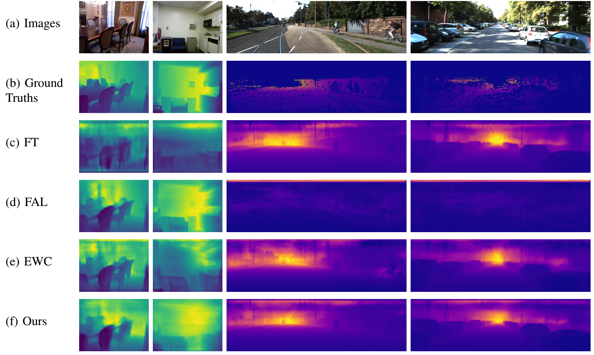

# Lifelong-MonoDepth: Lifelong Learning for Multi-Domain Monocular Metric Depth Estimation

We present an efficient multi-head framework that enables lifelong, cross-domain, and scare-aware monocular depth learning. For more detailed information, please check our [paper](https://arxiv.org/pdf/2303.05050.pdf).

Results
-
Qualitative comparisons.

 

Datasets
-
We provided data index of RGB and depth pairs for both training and test set of all three datasets in csv file, you can find them in ./datasets/. Then, download the data required for training and test.

+ NYU-v2, download via the [link](https://drive.google.com/file/d/1WoOZOBpOWfmwe7bknWS5PMUCLBPFKTOw/view?usp=sharing)  
+ KITTI, download via the [official homepage](https://www.cvlibs.net/datasets/kitti/eval_depth.php?benchmark=depth_prediction) 
+ ScanNet, download via the [official homepage](http://www.scan-net.org/#code-and-data) 

Running
-
+ ### Test 
	 Testing with domain prior: python test.py 
	 Testing without domain prior: python test_inference.py 
+ ### Train 
	 Training on a single-domain: python train_N.py 
	 Training on two domains: python train_NK.py 
   Training on three domains: python train_NK.py 

